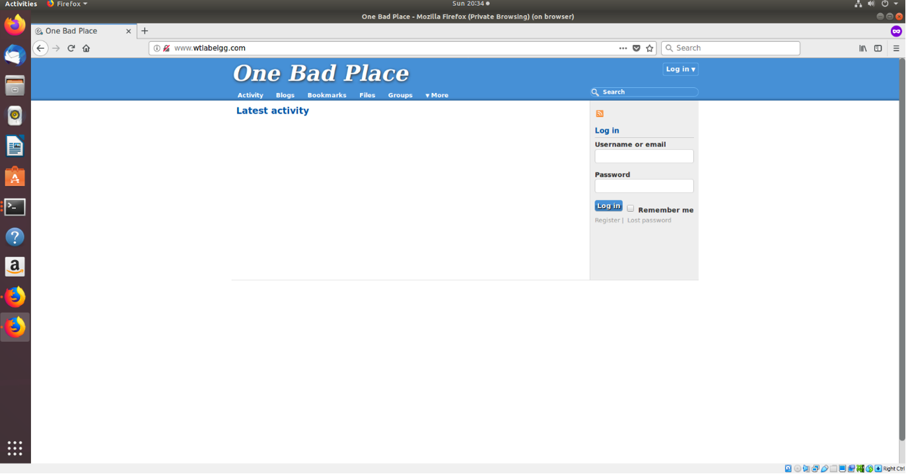

# Introduction

The objective of this lab is to understand how a user’s activity on the Internet is tracked and how it uses this data to make advertisements and modify the user’s experiences. It will be focusing on third-party cookies in terms of how they are saved on the browser, collect information, and share it with an advertising database. The lab will also show how the database uses this information to formulate an advertisement specifically for the user.

# Procedure

## Preparing the Lab Environment

There were a few steps of preparation I had to take before I could begin observing cookies. First, of course, I downloaded and formatted this report. Then, I opened Virtual Box and launched my virtual machine.  Once loaded, I type “labtainer webtrack” into the open console to load the lab. After a few moments, I enter my email and the lab is downloaded and launched. The figure below shows my virtual machine desktop after this process:

- _Figure 1_: The virtual machine lab environment. After downloading the lab, these three windows appear. To the left is a computer that is acting as host server for the lab’s websites; to the right is a computer that is acting as the browser; in the center is the Firefox browser window that opens; underneath is the main terminal that launched everything.

  

Next, I had to ensure that there is no prior data stored on the browser. To do this, I opened Firefox’s menu, selected “Preferences”, and opened the “Privacy & Security” section. The formatting is a bit different than what is shown in the directions, but the process was still the same.  I hit the “clear history” button and select all fields.

- _Figure 2_: Clearing history and cookie data. All fields are selected. After hitting “Clear Now”, the prompt disappears, and all data is cleared.

  

With this done, I am now ready to begin the lab tasks.

## Explaining the Basic Workings of Web Tracking

This first task serves as an introduction to cookies and how they are generally acquired. I begin by opening the lab’s Elgg page by typing its address in the address bar.

- _Figure 3_: The Elgg page. Save for a heading, a login field, and a few navigation links, the site is blank.

  

I now type the addresses of the e-commerce websites and open each of them in a different tab. To be thorough, I viewed the details of at least three products in each website. Satisfied, I return to the Elgg page and refresh it. The following figure shows the results:

- _Figure 4_: The refreshed Elgg page after visiting the e-commerce websites. The website is still the same, but now there is an image of a camera in the lower left middle portion of the screen.

  

This camera image is supposed to be an ad, and it was the first thing I viewed when browsing the stores. This leads me to believe that there was something tracking my browsing history, and there is some command on the Elgg page that uses it to form a relevant advertisement. I then closed and reopened the browser. The ad was still there which tells me that my data and browsing history was saved.

I also ran through this lab again only this time, I viewed even more products, stayed on the details page for varying times, and visited some products multiple times. Interestingly, after refreshing the Elgg page, it still looked the same. It seems this is due to that camera being my most viewed item. This leads me to believe that the advertising works by showing my most viewed item.

### Illustrate the importance of cookies in web tracking

This next task is rather large. First, I will be investigating how a cookie attaches itself to the browser. I open the camera store, and view details for my new favorite Sony camera. On this page, I open Firefox’s Web Development / Network tools and have a brief overview of the backend of the website. The site is written in HTML, uses CSS for formatting, and incorporates some scripts from JavaScript.

- _Figure 5_: 

The “Debugger” tab shows an organized version of the site’s code. Notice the inclusion of CSS and JavaScript elements.

  

- _Figure 6_: A snippet of the CSS formatting code. This is responsible for the colors and formatting seen on the page.

  

Also found in the development tools is the “Network” tab. With it, I can view the traffic that happens while on the page. The directions indicate that the cookie is sent through an HTTP request. There is not much traffic on the site, so it was fairly easy to find.

- _Figure 7_: A capture of the network traffic. Highlighted in blue is the HTTP packet in question that set the third-party cookie. This is proven in two ways: First, the “Co” column is short for “cookies”, and identifies how many cookies, if any, the packet contains. The “1” indicates that the packet has only one cookie. The second way is looking at the “Request headers” window in the bottom right and seeing that the cookie is shown along with its type. This cookie is called a “tracker” cookie.

  

I now need to figure out how the website sends this cookie to my browser. To do so, I right click on the page and select “View Page Source”. With this, I now have a better look of the site’s HTML. This cookie is third-party which means that it is coming from another domain. Therefore, there must be a link on the site that it is calling it. Looking at the packet properties in the previous figure, I see that it has a domain called “wtlabadserver”. I search through the HTML and find that there is a call to this domain. There is an  tag 1 pixel wide and 1 pixel high whose origin is the domain, “wtlabadserver”. It therefore seems that loading this tiny image from wtlabadserver.com allows a cookie to be attached to the store website.

- _Figure 8_: The page source for the camera store’s details page. Highlighted is the  tag that sets a 1 x 1 image with the source being the ad server.

  

### Third-party cookies

This next half of the task is dedicated better understanding third-party cookies. So far, I understand that the cookie I am investigating comes from a different domain. I will now be taking a closer look at this domain. For this part, I open the electronics store page and view the details of a TV. Next, I open another tab and type in the address of the cookie’s domain. Now, with both pages open, I open the developer tools and select the “Storage” tab. Here, I can see the data stored on each web page. First, I will look at the electronic store’s page:

- _Figure 9_: The storage properties of the electronics store. Notice that on the left-hand side, I have expanded and selected an entry under the “Cookies” category.

  

Analysis of the figure above indicates that no data is being returned in terms of cookies. This means that the store site itself does not carry any cookies. Next, I will look at the advertising site:

- _Figure 10_: The storage properties of the advertising site. Again, I have expanded the “Cookies” category and selected the entry under it.

  

This time, there are two cookies shown. Both originate from this site, but the “sessionID” expires once the session closes. However, the second one, “track” can be stored on the browser for a much longer time. This is the cookie that is sent to the store website.

From my understanding, the term “third-party” refers to someone or something that is not directly associated with the party or business of focus. Similarly, a third-party cookie “is a cookie that is associated with a domain name different from that of the page where the cookie is encountered” (At Internet). This makes sense because the tracker cookie is found on the adserver webpage (Figure 10) whereas there are no cookies originally on the store website (_Figure 9_); however, the web browser has an image tag that sends an HTTP request and brings the tracker cookie from the adserver to the store website. T tracker cookie is associated with a domain name different from the store website and is therefore considered a “third-party” cookie.

## Tracked User Interests and Data

I now know where the cookie comes from, and in this task, I will see how it works. To begin, I open all the e-commerce websites. From there, I view various product details on each of the pages and visited several of the same products’ multiple times. I then use the URL provided which takes me to a plaintext table in the ad server database.

- _Figure 11_: The table in the ad server database. From left to right, the columns are: Code for the product, the product’s human name, the product’s category, impression (view) count, and user tracking ID.

  

This table has correctly recorded all the products I visited and how many times I visited them. To go even further, I continued to view more products to see if the table would follow. After refreshing, the table did show the correct values. This means that the tracking is happening live.

This cookie does well to track me and notify the database. The question, then, is how the database knows that the activity is coming from me specifically. To answer, when a user views a product, an image file loads and calls the URL of the ad server so that the cookie is sent to the website. This cookie has a specific tracking number which is then assigned to the user.

- _Figure 12_: A closeup of the cookie’s HTTP request header. Take note of the “Cookie” field and the numeric value after “track =”. Interestingly, as an aside, this number is different each time the cookie is initially received even if it is for the same user.

  

The tracking number is then added to the ad server database which uses it to identify the user (Kaspersky). As a result, each time the user visits a page that sends the cookie, the database recognizes the tracking number, assigns it to the user, and logs the user’s activity. Therefore, the number of impressions can be correctly recorded.

- _Figure 13_: An entry in the ad server database table. At this point, I had visited the Sony camera page once. Notice that the “UserTrackID” is the exact same as the track number in the cookie’s request header.

  

## Explaing How Ads Are Displayed in a Website

Up to this point, I have explained how the cookie comes from a site, explained its origin, and how it helps record my activity in the database. I will now see how this data translates to a site that is not a store. In the Elgg homepage, I have established than an advertisement appears. This task will be explaining how this is so.

I reopen Elgg and establish that my camera ad is still there. I then open the developer tools and view the “Network” section.

- _Figure 14_: The network traffic for the Elgg page. Highlighted is the HTTP request from a different domain. As seen in the bottom right-hand window, this is the cookie from the store page as is indicated by the track value.

  

This establishes that my cookie is present and active on this site. Now the question is, “Why is it here?” To answer, I must look at the page source.

- _Figure 15_: The HTML behind the Elgg page. Highlighted is a mention of the ad server.

  

The highlighted line is an HTML <iframe> tag which “is used to embed another document within the current HTML document” (w3schools).  In this case, the Elgg page is embedding a document within the ad server named “displayads.php” (_Figure 16_, _Figure 17_).

- _Figure 16_: The “displayads,php” page. There is only a picture of the camera advertised to me.

  

- _Figure 17_: The page source of “displayads.php”. The URL indicates that the image comes from the database’s “image” directory.

  

This camera, which is my most viewed item, is shown because of the cookie on my browser. It is called with the <iframe> “display ad” URL and contacts the database. The database, in turn, reads the tracking number, finds my most viewed item by its product number, and then finds the corresponding image to display as an advertisement.

## Track in a Private Browser Window

I have seen that even if the browsing session is closed, Firefox still saves the tracking cookie it has gathered from the store pages. In this task, I will see if the same is true for Firefox’s private browser. I repeat the same steps that were done in Task 1 only this time everything is done in a private browsing window. Once I return to the Elgg page and refresh it, I see that there is still an advertisement showing.

- _Figure 18_: The refreshed Elgg page in a private browsing window. This time, the advertisement is of a shoe. This is probably because it was my most viewed item this time.

  

I then close the private browsing window. Upon re-opening, I find that the advertisement is gone.

- _Figure 19_: The Elgg page after opening re-opening the private browsing window. As mentioned, the ad is gone.

  

This is due to the properties of Firefox’s private browser. As its home page states, it does not save temporary data such as page and search histories and cookies. As such, when the browser is closed, the cookie it acquired is lost. Therefore, when Elgg’s <iframe> tag is asks for an advertisement, the database cannot find one for this browser and nothing is shown.

## Real World Tracking

Of course, this lab is a simplified demonstration of cookies. The websites are simple, and the lab uses an only one ad server specifically for them. This task will give some insight to how real-world data tracking looks. This time around, I am given URLs of real external websites: Dictionary.com, Amazon.com, and CareerBuilder.com. The goal is to identify HTTP requests with third-party cookies. I will do this by opening each website and looking at its network traffic with Firefox’s developer tools.

First, I will look at Dictionary.com:

- _Figure 20_: A capture of the network traffic in Dictionary.com. Highlighted is a third-party cookie as is indicated by a different domain name and the “Co” (Cookie) field stating it is carrying 22 cookies.

  

Unexpectedly, there is far more network traffic going on here than on the fake e-commerce sites. This also means more cookie activity. The cookie I have highlighted in the figure above is labeled as “KADUSERCOOKIE”.  This cookie is used to identify each browser that visits a website associated with the digital advertising company, PubMatic (PubMatic).

Next, I will look at CareerBuilder:

- _Figure 21_: Ditto, only this time with CareerBuilder.com and a different third-party cookie with a different domain.

  

Again, there is a lot of network activity on the site. The cookie I have selected here is labeled “A3” and is an ad targeting cookie for its domain, Yahoo (LinkedIn).

Finally, I must look at Amazon. However, this part of the lab would not work properly. The in-lab Firefox kept crashing every time Amazon’s page would load. I therefore had to find a workaround by using the virtual machine’s own version of Firefox. I feel that the data is not too different from what would be expected, but I would still nevertheless consider this a limitation.

- _Figure 22_: Network capture on Amazon’s page with the virtual machine’s version of Firefox. Highlighted is the only third-party cookie I could find.

  

This site was especially interesting because I could only find one third-party cookie. The rest are Amazon’s own first-party cookies. This cookie is labeled “tuuid” and stores a randomly generated number for recurring visitors for the e-advertising company, Ad Pepper Media (LinkedIn).

## Take Countermeasures

I will now see what happens if I repeat the process in Task 1 but this time, I set Firefox so that it rejects cookies. To begin, I revisit Firefox’s “Privacy & Security” settings and set the option for collecting data and cookies to “Never”. From there I open the e-commerce pages, view the detail of a product, and open the Network tab in the developer tools.

- _Figure 23_: The network traffic for the mobile store. To my surprise, there is still an HTTP request from the ad server (highlighted).

  

This looks like before, only upon closer inspection of the request header window, I see that there is no mention of a cookie. Moreover, the size of the transfer is only one byte (this would alternate between one and zero). I therefore conclude that Firefox is preventing the transmission of the cookie per my settings.

With this in mind, it is expected that the Elgg page would, in turn, have no ads. This turns out to be true.

- _ Figure 24_: The Elgg page refreshed after viewing several products. No ad is shown.

  

Once again, with no cookie to provide data to the ad server database, the database cannot fulfill Elgg’s request for an advertisement. To confirm, I view this page’s network traffic.

- _Figure 25_: The network traffic for the Elgg page with no cookies allowed. Highlighted is the HTTP request from the ad server.

  

Unlike the previous captures, there is no “Cookie” field in the request header, and the file transfer size is 0 bytes. This confirms that there are no cookies stored on the browser. With this done, the lab comes to a close.

# Conclusion

This lab is meant to be an introduction to cookies. The techniques I used analyzed them so that I could understand how they appear and how they work. This is relevant to real-world security because cookies act in the exact same way on the real internet as they do in this lab. I therefore believe these tools to be effective because it is likely that they will help with any third-party cookie. Overall, this lab was straightforward, but I had come across a prominent obstacle. There were many instances of the lab’s Firefox crashing and I would have to repeatedly restart several steps in the tasks. Moreover, I could not properly analyze Amazon’s page with the lab’s tools. If I were to expand this lab, I would have also liked to analyze malicious cookies as they also are a major threat in cyber security. I would have liked to see if they behave similarly and what measures can be done to handle them.

# References

- <a href="https://www.linkedin.com/legal/l/cookie-table" target="_blank">Cookie Table</a>

- <a href="https://www.w3schools.com/html/html_iframe.asp" target="_blank">HTML IFRAMES</a>

- <a href="https://pubmatic.com/legal/platform-cookie-policy/" target="_blank">Platform Cookie & Other Similar Technologies Policy</a> PubMatic

- <a href="https://www.atinternet.com/en/glossary/third-party-cookie-2/" target="_blank">Third-Party Cookie - Digital Analytics Definition</a> AT Internet

